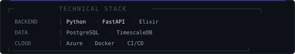

 

`ONLINE · MOGI DAS CRUZES, SP · UTC-03:00`

 

 

`SOFTWARE ENGINEER · CLOUD INFRASTRUCTURE · DISTRIBUTED SYSTEMS`

 

*Building distributed systems, telemetry pipelines, and secure cloud-native architectures.*  
*Focused on scalable Python backends and infrastructure that holds under pressure.*

 

&nbsp;&nbsp;

  

 

---

### `▎` Featured Project — **Plantelligence** `TCC 2026`

> Intelligent automation & monitoring system for Fungiculture greenhouses.

| | |
|---|---|
| **Architecture** | Decoupled microservices via WebSockets and RESTful APIs |
| **Security** | MFA, high-entropy hashing, end-to-end encrypted communications |
| **Cloud Native** | Automated Azure deployment · TimescaleDB for time-series analysis |

 

---

### `▎` Areas of Focus

`Distributed Systems` &nbsp;·&nbsp; `Cybersecurity` &nbsp;·&nbsp; `Telemetry` &nbsp;·&nbsp; `Cloud Architecture` &nbsp;·&nbsp; `IoT`

 

---

  

<i>"Software is a great combination between artistry and engineering." — Bill Gates</i>

 

